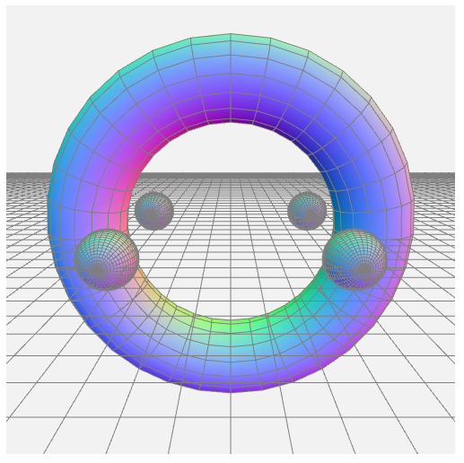
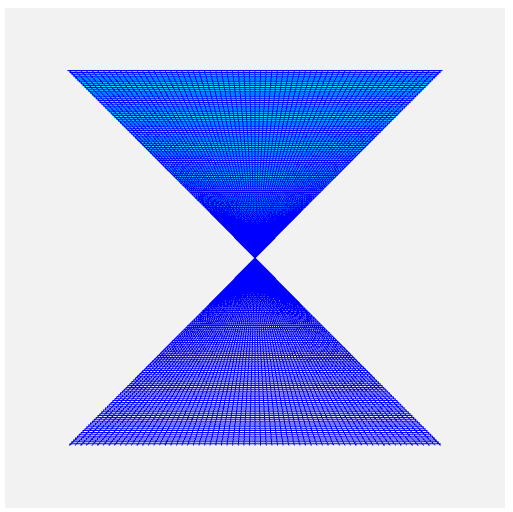
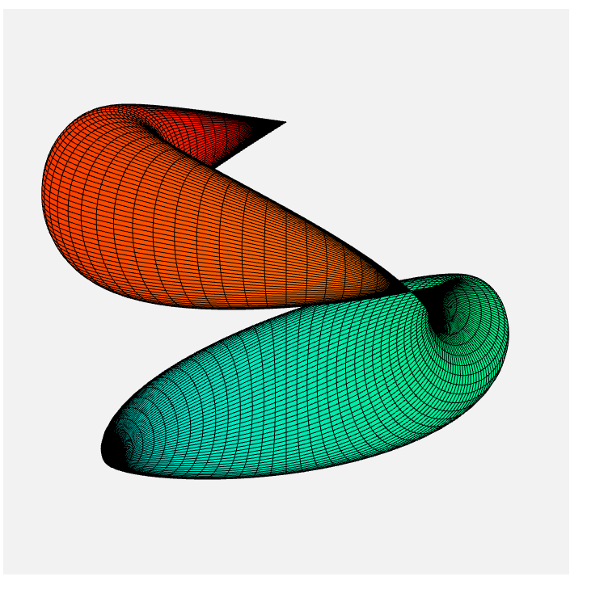

# Geometrical WebGL Graphics
This is a summary of self programmed geometrical graphics, made with WebGL and javascript.

The project includes 3 different geometrical graphic implementations:

* Flying spheres 
* Coloured surfaces
* Geometrical bodies

## Flying spheres
This are spheres circling around a torus.
To open, run **flying_spheres.html**.

## Coloured surfaces
This is a object made from coloured surfaces
To open, run **generated_colored_surfaces.html**.

## Geometrical bodies
Here you can see different geometrical bodies:

* Cresent
* Hyperbolic Helicoid
* Schnecke
* Flower Star (own parametrisation)

To open, run **generated_geometrical_bodies.html**.

